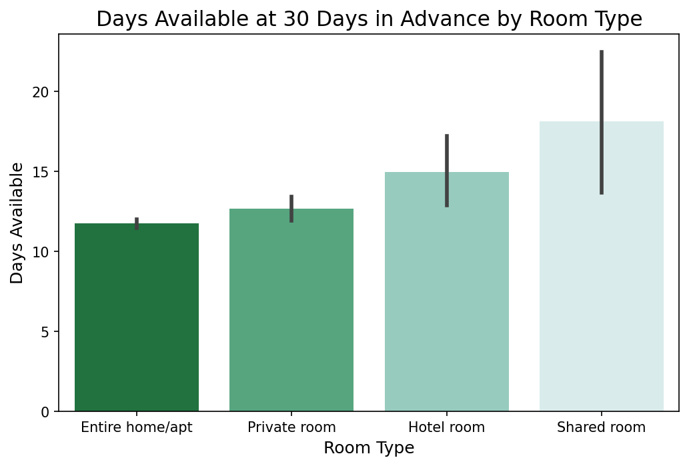

<div>

</div>

# New Orleans Airbnb Analysis
 
### Exploratory Data Analysis and Machine Learning Predictive Model
---
**Author:** Rachel Fein
 
This analysis was completed for Sarah Alter, a private investor, looking to expand her vacation rental portfolio to New Orleans. Alter is seeking to get a better understanding of New Orlean’s short term rental market as she prepares to invest. The goal for this project is to produce an exploratory data analysis and a price predictive model that can be used as a metric to aid in making decisions on what property and features would be best for her investment.

The dataset in this analysis comes from [Kaggle](https://www.kaggle.com/datasets/ruthgn/new-orleans-airbnb-listings-and-reviews). The dataset consisted of information for over 6000 airbnb listings in New Orleans, including the nightly price and a range of different property and listing features. Machine learning was used to develop a predictive model for nightly rate. The final model correctly predicts the nightly rate within $2.02. The model had an mean absolute error of 1.45. The exploratory data analysis assist in making general observations about the New Orleans short term rental market.  
 
## Business Problem
---
This analysis was completed for Sarah Alter, a private investor, who is interested in expanding her vacation rental portfolio to New Orleans, LA. Alter is new to the New Orleans vacation rental market and wants to use this analysis as a guide as she starts her search for a new property. To help Alter reach her goal, exploratory data analysis is used to get an overview of the market. EDA gives Alter a general understanding of what features seem to stick out in well performing rentals and neighborhoods. This analysis also provides a predictive model for nightly price. A predictive model will help Alter reach her goal by giving her a metric to compare properties currently on the market based on the property’s features. 

On Airbnb's [website](https://news.airbnb.com/about-us/) they revealed in June 2021 there were over 400 million hosts on airbnb and since 2008 hosts have earned over 150 billion dollars.
 
A [report](https://www.bizneworleans.com/n-o-tourism-spending-break-records-in-2019/) released in 2019 revealed that New Orleans welcomed 19.75 million tourists in 2019. Those visitors spent 10.9 billion dollars, 2.9 billion of which was spent on lodging.
 
While those statistics might make it seem like any property in New Orleans will do, even in a top tourism town like New Orleans that is not true. Not every investment property is a good one. Without a good understanding of the market and nightly rates, the chances of buying a bad investment property can rise.
 
## Data
---
The dataset in this analysis comes from [Kaggle](https://www.kaggle.com/datasets/ruthgn/new-orleans-airbnb-listings-and-reviews), however it is noted by the Kaggle that the data was originally pulled from [Inside Airbnb](http://insideairbnb.com/new-orleans/). The dataset was compiled on November 7, 2021 and all time oriented variables in this dataset are based around that date. The dataset contains 6,028 Airbnb listings in the city of New Orleans. 

The dataset originally started with 6,028 Airbnb listings in the City of New Orleans, after data cleaning and preprocessing 5,298 listings remained to build the model off of. Only features that were relevant and pertained to the business problem were used in this analysis. As well as a few additional features were removed when the analysis showed specific features were too highly correlated with each other. A detailed description of each feature can be found in [Exploratory Data Analysis notebook](./Exploratory_Data_Analysis.ipynb).

The most challenging aspect of this dataset was it contained many extreme outliers in a majority of the variables. As well it was limited in continuous features. 
 
## Methods
---
Data cleaning was performed in the [Exploratory Data Analysis notebook](./Exploratory_Data_Analysis.ipynb). When exploring the data at the start of the project it was found some listings had to be removed after noting the data seemed to be illogical. The majority of listings with missing data were able to be salvaged by replacing missing data with the median value for that variable, for example if a listing had no reviews, the review score was replaced with the overall median. 

During data preprocessing, outliers were removed, categorical data was encoded, skewed columns were transformed, and the data was standardized. Outliers were removed using the IQR method. Categorical data was encoded using OneHotEncoder and OrdinalEncoder both from feature_engine. Skewed columns were transformed using the Box-Cox method in PowerTransformer from Sklearn. The data was standardized using StandardScaler from sklearn. 
 
Data modeling was performed in the [Model Notebook](./Model.ipynb). A baseline model was created and future models were compared to the baseline model to determine if the model’s performance was being improved. The main performance metric used to evaluate the success of the model was the Root Mean Square Error. The Mean Absolute Error and Mean Square Error were also viewed for each model to help gain a better understanding of its performance. Multiple different types of models were run and GridsearchCV was used to attempt to improve the models. Feature selection was implemented on the two best performing models (Linear Regression and Random Forest). Feature selection methods implemented were ANOVA, Lasso, and embedded feature importance that used only features of top importance determined by the coefficients for that specific model. 
 
## Evaluation
---
The goal of this analysis was to gain information about the New Orleans short term rental market by using exploratory data analysis and develop a machine learning price predictive model that could be used as an aid while searching for an investment property.

The exploratory Data Analysis (EDA) proved to find general relationships among the data to get a grasp on the New Orleans short term rental market. Gaining a better understanding of the features of well performing rentals, including neighborhood, property type, number of bedrooms, and room type can help narrow down search criteria and properties. Some highlights from EDA are shown below:

<div>

</div>

Knowing where the most densely populated areas are for airbnbs give a lead to the best neighborhoods to purchase an Airbnb. Now that the areas are known, this information can be used to further investigate why investors continually choose these neighborhoods. 

<div>

</div>

Knowing where the highest priced Airbnbs is also important as the highest priced can mean higher profits. 

<div>

</div>

It is important to recognize which neighborhoods have the most airbnbs. This data set contained 72 different neighborhoods yet the large majority of airbnbs are located in just a few neighborhoods. Making observations on these neighborhoods is a good starting point since there is almost certainly a reason why these neighborhoods attract short term rentals. Such reasons can be local laws, housing prices, or housing types such as more multifamily housing. Choosing to purchase in a neighborhood where many of the neighbors are already airbnbs not only suggests there is a good return to be made in those areas but also it can help protect your business from growing local laws and restrictions.

In this analysis the target variable is price. Viewing  the average nightly rate for the trending neighborhoods can help you pinpoint what areas to start your search. It is also important to view the neighborhoods with the highest nightly rate, since this is a business after all and higher rates can mean better returns. 


<div>

</div>

Having little availability at 30 days out is a good sign that the Neighbourhood is highly sought after by tourists and good business for the Airbnb owners. We look at availability since many investors believe this is the most important statistic for estimating profits. As a high rental price can mean less, if the rental is not getting booked. 

Visualizing the difference between the most common neighborhoods and the highest priced neighborhoods gives a better understanding of the overall market. We see that 'Central City', 'Lower Garden District', 'Marigny', 'Central Business District', 'Treme - Lafitte', 'French Quarter' are all neighborhoods that are both part of the highest count and highest priced neighborhoods.

<div>

</div>

To get a better understanding of what type of property is more valued by travelers we see which room type has the highest average price. 

<div>

</div>

Less availability is better, this visual suggests that renting out an Entire home has a better chance of being booked than the other room types.
 
Having a well performing predictive model will prove helpful when comparing properties to buy and help determine not only the price point per night one should expect but also intuitively help decide what price point the property should be around to reach the return on investment (ROI) that works for Alter. The final model was a Random Forest model that had a RMSE of $2.02. The RMSE is the root square error of the entire model's error, it helps us understand how spread out the data is around the line of best fit by using the difference between the observed values and the predicted values. The baseline model had a RMSE of $3.18 for comparison. The final model had an MAE of 1.45. The MAE is a metric that gives us the absolute difference between actual and predicted values. The final model went through feature selection. Feature selection can help improve a model because it can reduce overfitting and remove possible redundant features, which helps remove noise that can harm and distract the data.
 
The final model metrics were:
- Test Mean Absolute Error : 1.45
- Test Mean Squared Error: 4.09
- Test Root Mean Square Error :$ 2.02
- Train Root Mean Square Error :$ 1.39
 
## Recommendations & Conclusion
---
The business problem was to gain a general understanding of the New Orleans short term rental market using EDA and develop a predictive model for the nightly price of an Airbnb in New Orleans. This analysis was created for Sarah Alter, an investor who is interested in expanding her vacation rental portfolio to New Orleans. This analysis is intended to be used as a guide as Alter starts her search for a new property.

The exploratory Data Analysis proved to find general relationships among the data to get a grasp on the New Orleans short term rental market, which can help narrow down search criteria and properties. Through EDA the neighborhoods that have the most airbnbs and neighborhoods that have the most expensive rentals were able to be pinpointed. EDA also gave insight on which neighborhoods are the most booked, which is a critically important characteristic when picking where to invest.

The machine learning analysis showed that there is enough good data to develop a predictive model that correctly predicts the nightly rate within $2.02. Having a well performing predictive model will prove helpful when comparing properties to buy and help Alter determine not only the price point she should expect to rent a property at but also help her decide what the purchase price for a property should be around to get the ROI that works for her.   
 
In summary this analysis showed:
- The final model had an RMSE of $2.02 on the test set.
- The final model had a MAE of 1.45 on the test set.
- The Exploratory Data Analysis shows to be informative in getting an general understanding of the New Orleans' Short term rental market to aid Alter in her property search. Such as which neighborhoods have the highest priced airbnbs and the lowest availability.
 
#### Next steps:
 
Adding more continuous & relevant variables. New Orleans is a large city and even within each neighborhood price data can vary. Reflecting on what makes an Airbnb attractive to tourists and adding those features into the model can help get even a better representation of the New Orleans market. Such features which might be interesting to add is distance to the airport and top tourist attractions. More features can be added to this model using API to source this data from places such as Google Earth.

Take into consideration seasonality. This dataset is based around November 7, 2021. However, it is not noted whether it is the main season for New Orleans or not. Importing data from Inside Airbnb for different times of the year might show different price predictions and endup changing your expected ROI.  

Use what was gathered from EDA to further investigate specific neighborhoods. EDA showed which neighborhoods had the most Airbnbs. Researching those neighborhoods might show that they have benefits that other neighborhoods don't, such as less restrictions or qualifications placed on them by the city or county.

## Reproducibility
--- 
If you wish to reproduce this analysis, follow this [Kaggle link](https://www.kaggle.com/datasets/ruthgn/new-orleans-airbnb-listings-and-reviews). The link will bring you to the dataset and you can download it. All packages and specific versions used in this analysis can be found in the [environment.yml](./environment.yml) file.

## Repository Structure
---

```
├── Data
├── Images
├── Exploratory_Data_Analysis.ipynb
├── Model.ipynb
├── Airbnb_Analysis_Presentation.pdf
├── README.md
└── environment.yml
```